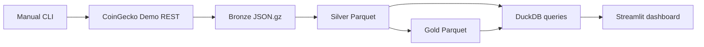

# Architecture

## Implemented local flow



The CLI is the only trigger. `collect all` makes one market request and one global request, writes
each successful response immediately, then rebuilds the local analytical datasets. There is no
background scheduler, streaming transport, database service, or cloud adapter.

## Boundaries

- Requests come only from the reviewed job catalog; callers cannot supply arbitrary URLs.
- CoinGecko credentials come from the process or ignored `.env` file and never enter Bronze.
- Bronze uses unique, exclusive-create filenames and is never overwritten by transforms.
- Silver and Gold write temporary Parquet files and atomically replace their derived outputs.
- Streamlit reads local Parquet through DuckDB and never receives the API key.
- Normal tests block the network and use sanitized fixtures.

## Runtime layout

```text
data/
├── bronze/coingecko/entity=<name>/year=YYYY/month=MM/day=DD/hour=HH/*.json.gz
├── silver/market_snapshot.parquet
├── silver/global_market.parquet
└── gold/market_overview.parquet
```

All runtime data is ignored by Git. Rebuilding Silver scans all local MVP Bronze objects. That is
deliberately simple for a local portfolio project; partitioned incremental output should only be
introduced after actual history makes rebuild time a measured problem.

## Deferred work

Coin Detail, Trending & Category Analytics, scheduling, data-quality quarantine, and AWS are not
implemented. If AWS is added later, local files can map to S3, manual commands to Lambda and
EventBridge, DuckDB queries to Athena, and the same data contracts can be retained. No cloud
resource should be created before the local MVP proves a need.
