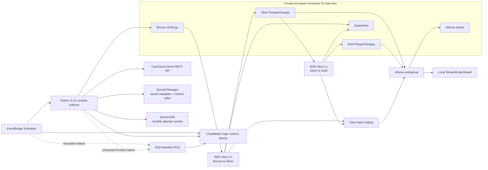

# Architecture

## Context

CryptoPulse is a single-account, single-region educational deployment in `ap-southeast-1`. It favors managed serverless services, explicit contracts, and low idle cost. All service-to-service traffic uses AWS public service endpoints from AWS-managed runtimes; Lambda is not attached to a VPC, so no NAT Gateway is required.

## Logical architecture



The usage counter is the only stateful service added to the supplied core diagram. It is necessary for an atomic ceiling across concurrent Lambda invocations; logs and CloudWatch metrics are not transactional gates.

## Collection design

### Scheduler

One EventBridge Scheduler schedule per job sends a small allow-listed event such as `{"job_name":"market_snapshot"}` to the same Lambda. No event may supply an arbitrary URL, method, header, or unvalidated query parameter.

Planned UTC expressions are:

| Job | Expression | Notes |
|---|---|---|
| `market_snapshot` | `cron(0/10 * * * ? *)` | every ten minutes |
| `global_market` | `cron(2 * * * ? *)` | hourly, offset from market snapshot |
| `trending` | `cron(4 * * * ? *)` | hourly |
| `categories` | `cron(6 0/6 * * ? *)` | every six hours |
| `coin_ohlc` | `cron(45 0 * * ? *)` | after CoinGecko's 00:35 UTC availability note |
| `exchanges` | `cron(10 1 * * ? *)` | daily |
| `coin_list` | `cron(15 1 * * ? *)` | daily |
| `coin_metadata` | `cron(20 2 ? * SUN *)` | weekly; 20 sequential coin requests |
| Bronze-to-Silver | `cron(15 3 * * ? *)` | daily processing schedule |
| Silver-to-Gold | Glue success trigger | never runs after a failed Silver job |

Flexible time windows are off. `historical_backfill` has no Scheduler resource and is invoked manually with an explicit coin allow-list.

### Lambda execution sequence

```mermaid
sequenceDiagram
  participant E as EventBridge Scheduler
  participant L as Lambda
  participant D as DynamoDB usage gate
  participant C as CoinGecko
  participant S as S3 Bronze
  participant Q as SQS DLQ

  E->>L: allow-listed job_name
  L->>L: validate event; create run_id
  loop each configured endpoint request
    L->>D: conditional increment before attempt
    D-->>L: count <= 9000 or reject
    L->>C: GET with demo header
    C-->>L: response
    Note over L,C: HTTP retry scope ends after success
    L->>L: envelope + gzip held in memory
    L->>S: create unique object; SDK retries only the write
    S-->>L: success
  end
  alt exhausted failure
    L--xQ: failed async event after zero Lambda retries
  end
```

The client performs at most four total attempts: the initial request plus three retries. Permanent 400, 401, and 403 responses fail immediately. Transport errors, 408, 429, and 5xx are retryable with exponential backoff and bounded jitter; a valid `Retry-After` is the minimum delay. Typed exceptions retain safe status/context but never request headers, response bodies, or secret-bearing URLs.

Lambda asynchronous function retries are set to zero. This is deliberate: the client already performs bounded API retries, the S3 SDK retries the same in-memory response, and a full function replay after a successful HTTP response could spend another credit. Exhausted failures move to SQS for diagnosis and deliberate replay.

### Identity and observability

- `run_id`: one UUID per logical job invocation and shared across every scoped coin request.
- `request_id`: one UUID per outbound logical request, stable across its retry attempts.
- `aws_request_id`: Lambda invocation ID from the runtime context.
- Latency is measured with a monotonic clock and logged in milliseconds.
- JSON logs include event name, job, endpoint path, safe parameters, attempt, status, latency, budget count, and IDs.
- Logs never include authorization headers, the secret value, Secrets Manager response bodies, or exception representations that contain request headers.

CloudWatch alarms cover Lambda `Errors`, Scheduler `TargetErrorCount`/`InvocationDroppedCount`, DLQ visible messages, Glue failures, and data-quality failures. Logs use finite retention.

## API-usage guard

The DynamoDB on-demand table stores one counter item per UTC month. A conditional atomic update reserves an attempt before the HTTP call and rejects any update that would exceed 9,000. The table also stores one-time warning flags for 7,000 and 8,500 to prevent log storms. Items receive a TTL after operational retention, but TTL is not used to reset active counters.

This counter is intentionally an estimate rather than billing truth:

- It counts failures and retries, while CoinGecko currently deducts monthly credit only for HTTP 200.
- It cannot see calls made by other systems using the same key.
- Operators reconcile it with CoinGecko's developer dashboard and account alerts.

At the ceiling, the handler records a successful suppressed invocation without calling CoinGecko. Non-critical schedules remain deployed but make no external request. Critical jobs are also blocked by default to preserve the internal ceiling; an emergency override is an explicit, audited configuration change.

## Storage design

### Bucket and prefixes

One environment-specific bucket uses these prefixes:

```text
bronze/coingecko/entity=<entity>/year=YYYY/month=MM/day=DD/hour=HH/*.json.gz
silver/table=<table>/snapshot_date=YYYY-MM-DD/run_id=<transform-run-id>/*.snappy.parquet
gold/table=<table>/snapshot_date=YYYY-MM-DD/run_id=<transform-run-id>/*.snappy.parquet
quarantine/table=<table>/snapshot_date=YYYY-MM-DD/run_id=<transform-run-id>/*.json.gz
quarantine/schema-drift/entity=<entity>/detected_date=YYYY-MM-DD/*.json
athena-results/workgroup=<environment>/*
```

Bronze filenames include job, UTC request time, run ID, request ID, and scoped coin ID when applicable. Unique keys and a conditional create prevent accidental replacement. The collector can `PutObject` only under Bronze and cannot delete or read unrelated prefixes. Glue reads Bronze and writes only staged Silver/Gold/Quarantine locations. Athena reads Silver/Gold and writes only its result prefix.

The bucket configuration includes:

- all four S3 public-access blocks;
- bucket-owner-enforced object ownership;
- SSE-S3 (`AES256`) default encryption;
- versioning;
- TLS-only bucket policy;
- lifecycle expiry of current Bronze objects after 365 days and noncurrent versions after 30 days;
- short retention for incomplete multipart uploads and Athena results.

Small gzip objects remain in S3 Standard rather than being transitioned to an infrequent-access class with small-object minimum charges. Object Lock is not enabled in the default dev/demo environment because it complicates cleanup and this project has no compliance retention requirement. Workload IAM, unique create-only keys, and versioning provide application-level immutability and preserve original versions.

### Bronze write contract

Each HTTP 200 response is immediately wrapped with collection metadata, serialized without modifying `payload`, gzip-compressed, and written before processing the next scoped request. `parameters` contains only allow-listed non-secret query values. Response headers are not stored.

`record_count` is deterministic by endpoint:

- array response: array length;
- singleton object: `1`;
- trending: sum of the `coins`, `nfts`, and `categories` array lengths;
- market chart: count of distinct timestamps across price, market-cap, and volume series.

## Processing design

### Bronze to Silver

AWS Glue 5.1 reads a bounded UTC date window from Bronze, parses the immutable envelope with explicit `StructType` definitions, and performs:

1. Envelope and response-schema validation.
2. UTC timestamp normalization.
3. Safe decimal casts and endpoint-specific flattening.
4. Reusable quality checks.
5. Invalid-row quarantine with all failure reasons.
6. Deterministic deduplication by table business key and documented tie-breaker.
7. Snappy Parquet write to a new run-scoped location.
8. Data Catalog partition-location update only after output validation succeeds.

No Glue crawler is used. A bounded re-read is simpler and safer than relying on bookmark modification times for late arrivals. For a rebuilt `snapshot_date`, the new complete Parquet output is staged under a new run ID; then that partition's Catalog location is switched to the new prefix. Old run prefixes remain recoverable until lifecycle cleanup.

Local Glue tests use AWS's published `public.ecr.aws/glue/aws-glue-libs:5` image, which covers Glue 5.0, Python 3.11, and Spark 3.5.4. It is the nearest official local compatibility environment, not an assertion of exact Glue 5.1 parity. Exact managed-runtime behavior is an opt-in AWS integration check before deployment.

### Silver to Gold

The Gold job starts only after Silver succeeds. It reads Catalog-selected Silver partition locations, computes the eight defined aggregates, runs reconciliation checks, writes new run-scoped Parquet, and updates Gold partition locations. A failed Gold run leaves the previous Catalog locations intact.

### Schema evolution and quarantine

The transform compares the observed payload field paths/types with the versioned expected schema:

- Additive unknown fields create a schema-drift manifest and warning while known compatible fields continue.
- Missing required fields, incompatible type changes, cast overflow, and failed row checks send records to quarantine.
- Batch checks such as missing windows and low market-snapshot counts create quality-result rows even when no individual record can be quarantined.
- Raw Bronze is never corrected or deleted by a transform.

## Catalog and Athena

Terraform creates databases, table shells, explicit columns, partition keys, and an Athena workgroup. Glue jobs own partition locations after successful transforms. All financial numeric fields use decimal types; partition key `snapshot_date` is low-cardinality and `coin_id` is never a partition key.

The Athena workgroup enforces its S3 result location and encryption. The local Streamlit application uses the caller's AWS credential chain, submits read-only Athena queries, polls results, and displays query/data freshness. It never receives the CoinGecko key.

## Secrets

Terraform creates only a Secrets Manager secret resource and outputs its ARN; it does not create a secret version. Population is manual or performed by protected CI using a secret that never enters Terraform configuration, variables, plan output, or state.

Local development reads `COINGECKO_API_KEY` only when an explicitly allowed live command runs. Normal tests construct the client with a dummy injected value and a mock transport. The source file in the user's Downloads directory is never copied into the repository.

## IAM boundaries

Separate roles are planned for:

- Scheduler target invocation and DLQ delivery.
- Lambda collection (specific secret read, usage-table update, Bronze put, logs only).
- Glue Silver and Gold jobs (specific input/output prefixes, Catalog partitions, logs only).
- GitHub deployment through OIDC with environment-scoped Terraform permissions.
- Local dashboard/Athena user (Athena execution, Catalog read, Silver/Gold read, result write only).

No role receives `s3:*`, `secretsmanager:*`, or account-wide administrative permissions. Resource ARNs and prefix conditions are used wherever the service supports them.

## Terraform layout

```text
terraform/
├── modules/
│   ├── storage/       # S3 bucket, policies, lifecycle
│   ├── collector/     # Lambda, secret metadata, DynamoDB, schedules
│   ├── processing/    # Glue jobs, roles, Catalog
│   └── observability/ # SQS, alarms, log groups, optional AWS Budget
└── environments/
    └── dev/           # provider, backend, module composition, tfvars example
```

AWS Budget creation will be opt-in because notification subscriber addresses are environment-specific. Documentation and cleanup commands remain mandatory even when the resource is disabled.

## Tags

Every taggable resource receives:

| Key | Value |
|---|---|
| `Project` | `CryptoPulse` |
| `ManagedBy` | `Terraform` |
| `Environment` | `dev` or `demo` |
| `Owner` | `NguyenPhuTrieu` |

## Recovery and replay

- A failed collector event is inspected in SQS using only safe metadata.
- Operators first search the deterministic Bronze prefix and run/request IDs to determine whether a response was already stored.
- If Bronze exists, replay starts processing only; CoinGecko is not called.
- If Bronze does not exist and the failure record proves no successful response was persisted, an operator may deliberately replay the collection subject to the budget gate.
- A failed transform leaves previous Catalog partition locations live. The failed run-scoped prefix can be inspected or removed by an operator after validation.
- Historical backfill always requires explicit manual invocation and budget confirmation.

## References

- [CoinGecko official documentation index](https://docs.coingecko.com/llms.txt)
- [CoinGecko Demo endpoint overview](https://docs.coingecko.com/demo/reference/endpoint-overview)
- [CoinGecko errors and rate limits](https://docs.coingecko.com/docs/errors-and-rate-limits)
- [EventBridge Scheduler dead-letter queues](https://docs.aws.amazon.com/scheduler/latest/UserGuide/configuring-schedule-dlq.html)
- [EventBridge Scheduler CloudWatch metrics](https://docs.aws.amazon.com/scheduler/latest/UserGuide/monitoring-cloudwatch.html)
- [AWS Glue versions](https://docs.aws.amazon.com/glue/latest/dg/release-notes.html)
- [Develop and test AWS Glue jobs with the official local Docker image](https://docs.aws.amazon.com/glue/latest/dg/develop-local-docker-image.html)
- [Athena with Glue Data Catalog](https://docs.aws.amazon.com/athena/latest/ug/data-sources-glue.html)
- [S3 Object Lock](https://docs.aws.amazon.com/AmazonS3/latest/userguide/object-lock.html)
